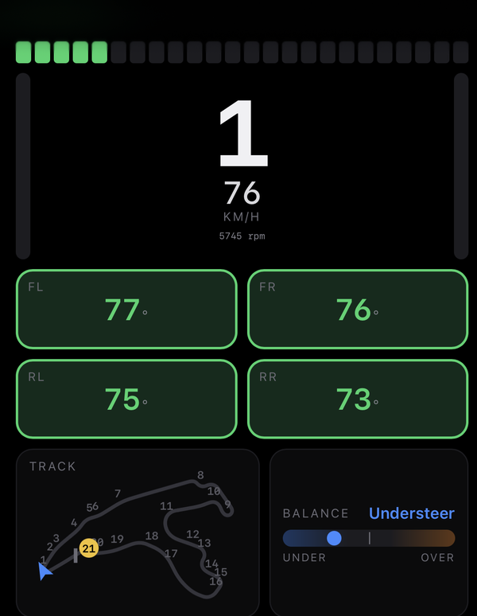
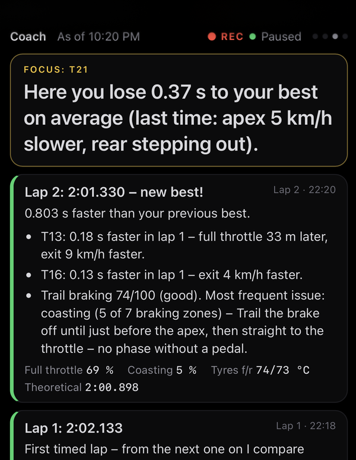
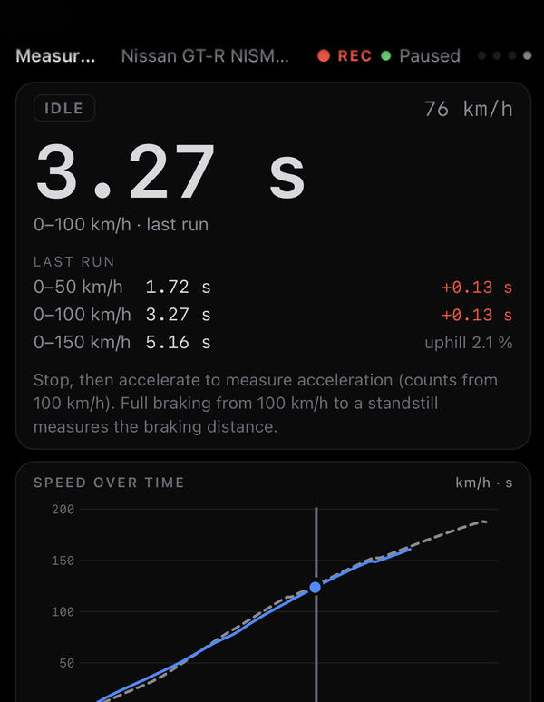
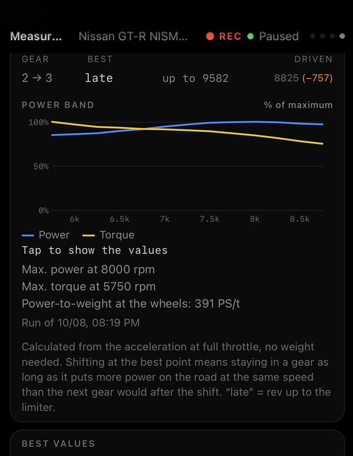

# Apexline

Live telemetry dashboard and driving coach for **Gran Turismo 7** on PS5.
Runs on your computer, shows on your phone.

  
  
  
  

## Features

- **Dashboard** for your phone: tyre temperatures, gear, speed, rev lights, pedals, track map,
  understeer/oversteer, lap times with live delta, fuel – plus a page with every telemetry channel.
- **Coach:** after every lap it compares each corner with your best lap and tells you where you
  lose time and why, rates your trail braking and sums up the session.
- **Measurements:** 0–60 mph / 0–100 km/h, quarter mile and braking distances are measured
  automatically, together with the best shift point for each gear.
- Records every lap, finds your PS5 by itself, English and German, imperial and metric units.

## Quick start

1. Download the file for your computer from
   [Releases](https://github.com/Pflegusch/apexline/releases) and unpack it.
2. Start Apexline:
   - **Windows:** double-click `apexline.exe` and allow network access when asked.
   - **macOS:** in Terminal `xattr -d com.apple.quarantine ./apexline && ./apexline`
     (the program is not signed).
   - **Linux / Raspberry Pi:** `./apexline`
3. Start GT7 on the PS5 in the same network – Apexline finds it automatically.
4. On your phone, open the address Apexline prints, e.g. `http://192.168.0.10:8080`.
   On iPhone use *Share → Add to Home Screen* for full screen.

Swipe to switch pages, long-press to open the settings.

## Troubleshooting

- **No data:** PS5 and computer must be in the same network, and the firewall must allow
  UDP 33739/33740 and TCP 8080. You can also set the PS5's IP address: settings (long press) →
  Server, or start with `apexline --ps5 192.168.0.33`.
- **Port 8080 is taken:** `apexline --port 8081`
- `apexline config` shows where the settings and recordings are stored.

## More

- `apexline demo` – simulated data, no PS5 needed
- `apexline analyze <session folder>` – corner-by-corner analysis in the console
- Start at boot on Linux / Raspberry Pi: [`deploy/systemd/apexline.service`](deploy/systemd/apexline.service)
- Known limitations: see the [changelog](CHANGELOG.md)
- Build from source: `cargo build --release`

## License

MIT or Apache-2.0, at your option. Contributions welcome, see [CONTRIBUTING](CONTRIBUTING.md).

Apexline is not affiliated with Sony Interactive Entertainment or Polyphony Digital. "Gran Turismo"
and "PlayStation" are their trademarks. Packet format after [Nenkai/PDTools](https://github.com/Nenkai/PDTools),
car names from [ddm999/gt7info](https://github.com/ddm999/gt7info).
